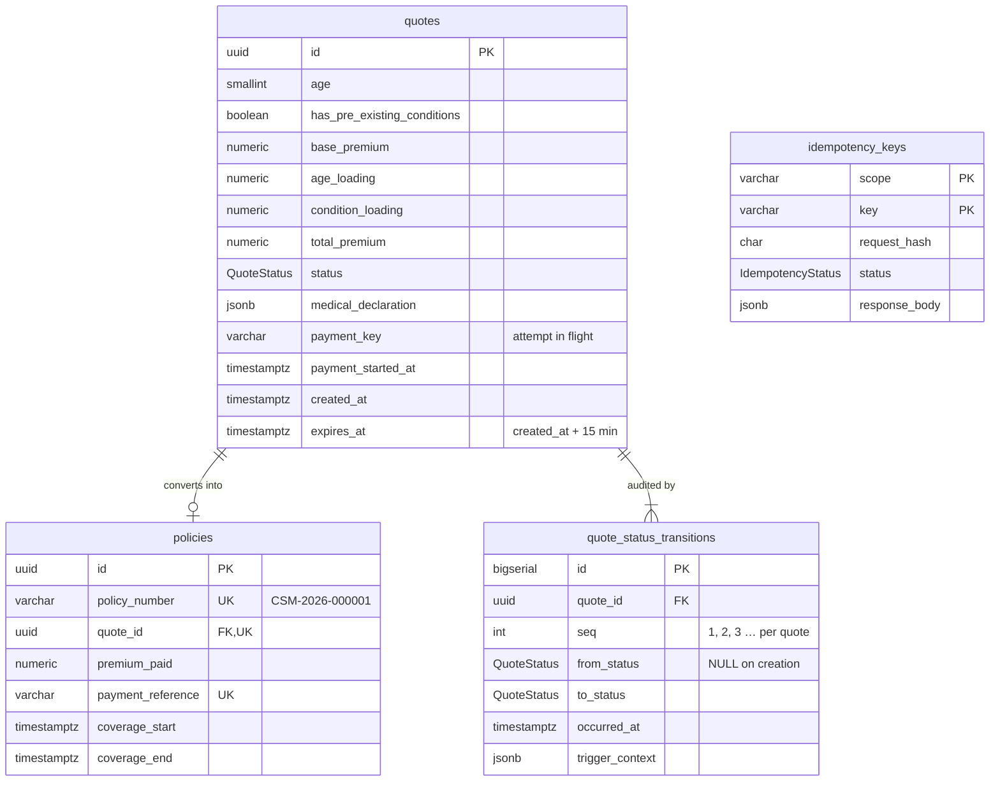

# @careshield/api

NestJS REST API for the CareShield Max purchase journey. All routes are under `/api/v1`.

```bash
npm run start:dev        # http://localhost:4000 (needs apps/api/.env)
npm test                 # unit tests (no database)
npm run test:db          # schema rules against a migrated PostgreSQL
npm run test:e2e         # whole API over HTTP
npm run db:migrate       # apply migrations
```

## Code layout

```
src/
├── main.ts, configure-app.ts   startup: /api/v1 prefix, validation pipe, error filters
├── prisma/                     the shared database client
├── common/                     strict validation, error → HTTP mapping (incl. DB outage → 503), request ids
├── health/                     /health/live and /health/ready
└── insurance/
    ├── domain/                 pure business rules: pricing, state machine, 15-min lock, eligibility
    ├── dto/                    request validation and response shapes
    ├── insurance.controller.ts POST /quote, POST /quote/:id/medical-declaration
    ├── quotes.service.ts       quote logic
    ├── quotes.repository.ts    the only code that changes a quote's status (+ audit context)
    └── checkout/               POST /checkout (begin → gateway → settle), idempotency, mock gateway,
                                payment webhook, status poll, reconciler
api/index.js                    Vercel serverless entry (wraps the compiled app in dist/)
prisma/
├── schema.prisma               tables: quotes, policies, quote_status_transitions, idempotency_keys
└── migrations/                 SQL, including the hand-written CHECKs and triggers
```

## Data model



**State machine:**

```
QUOTE_GENERATED → MEDICAL_DECLARED → PENDING_PAYMENT → PREMIUM_PAID → POLICY_ISSUED
                         ↑                  │
                         └── payment failed ┘
```

`PENDING_PAYMENT` means a payment has started and is recorded before the gateway is called. It freezes the 15-minute clock: the lock applies to declaring and to **starting** a payment, not to settling one that started in time. The only backward step is a definitively failed payment, which returns the quote so the customer can try another card.

It's enforced twice:

- **In code:** `quotes.repository.ts` does a compare-and-set `UPDATE … WHERE status = <from>`, so two simultaneous requests can't both advance a quote.
- **In the database:** the trigger `enforce_quote_lifecycle` rejects any other step, declaring or starting a payment after `expires_at`, a pending payment without its `payment_key` (or swapping it mid-flight), and any change to a quote's price or expiry. The trigger `enforce_policy_from_paid_quote` only allows a policy for a paid quote, at exactly the quoted amount.

### Audit trail

Every status change also leaves one row in `quote_status_transitions`: `(quote_id, seq, from_status, to_status, occurred_at, trigger_context)`.

- **Written by the database, not the app.** AFTER triggers on `quotes` insert the row, so no code path, script or manual SQL can change a status without a record. They run only after `enforce_quote_lifecycle` accepts the change, and in the same transaction, so a rolled-back or refused change leaves nothing.
- **Sequential.** `seq` counts 1, 2, 3 … per quote; the first row (creation) has `from_status = NULL`. The quote's row lock plus a unique `(quote_id, seq)` index keep the numbers gap-free under concurrency.
- **Immutable.** A trigger rejects every `UPDATE` and `DELETE`, and a quote with history can't be deleted. For production, also run the API as a role without `UPDATE, DELETE, TRUNCATE` on the table.
- **`trigger_context` says why.** The API calls `set_config('app.audit_context', …, true)` in the same transaction (`QuotesRepository.setAuditContext`): `action` (`quote.created`, `quote.medical_declared`, `checkout.premium_paid`, `checkout.policy_issued`), `requestId` (also returned as the `X-Request-Id` header), `callerIp`, `userAgent`, and for checkout `idempotencyKey` plus `paymentReference` / `policyNumber`. The database always adds `dbUser` and `txid` itself, so they can't be faked. A change made outside the API is recorded as `{"source": "database"}`.
- **Backfilled.** The migration reconstructs the history of quotes that already existed from their `created_at`, `medical_declared_at` and policy `issued_at` (marked `"source": "backfill"`).

## Endpoints

| Endpoint | Success | Errors |
| -------- | ------- | ------ |
| `POST /insurance/quote` `{ age, hasPreExistingConditions }` | 201 quote | 400 validation |
| `POST /insurance/quote/:id/medical-declaration` (6 booleans + `confirmsAccuracy: true`) | 200 quote | 400 · 404 · 409 already declared · 410 expired · 422 not eligible |
| `POST /insurance/checkout` header `Idempotency-Key`, body `{ quoteId, paymentToken }` | 201 policy · **202** still processing | 400 · 402 declined · 404 · 409 in progress / payment in progress / already paid / not declared · 410 expired · 422 key reused |
| `GET /insurance/quote/:id/payment` | 200 `{ state: ISSUED \| PROCESSING \| NOT_PAID }` | 404 |
| `POST /payments/webhook` (signed by the payment provider) | 200 `{ received, result }` | 400 malformed · 401 bad signature · 503 not configured |
| `GET /payments/reconcile` header `Authorization: Bearer $CRON_SECRET` | 200 `{ checked, results }` | 401 · 503 not configured |
| `GET /health/live` | 200 | never touches the database |
| `GET /health/ready` (alias `/health`) | 200 | 503 `down` or `timeout` (2 s) |

- **Validation is strict:** no type conversion (`"30"` is not a number), unknown fields are rejected, and age must be a whole number from 18 to 99.
- **Money is returned as strings** (`"15000.00"`).
- **Quote responses include `remainingMs`:** the lock time left, computed on the server when it answers. The website counts down from it instead of comparing its own clock with `expiresAt` (still included, for display).
- **Every response has an `X-Request-Id`** (a well-formed incoming one is reused); it is stored in the audit trail.
- **If the database is unreachable,** every endpoint returns **503** with `Retry-After`.

**Pricing** (`domain/premium-calculator.ts`) uses exact decimals:

| | Amount |
| --- | --- |
| Base premium | ₹10,000 |
| Age over 45 (46 and up) | +50% of base |
| Pre-existing conditions | +₹5,000 flat |

## Checkout: short transactions, idempotent, settled once

The payment gateway is **never called inside a database transaction**. A slow provider would otherwise hold a pooled connection and the quote's row lock for as long as it takes.

1. **Claim the `Idempotency-Key`** by inserting it with status `IN_PROGRESS`. The primary key means exactly one of several simultaneous requests wins.
   - A repeat of a **finished** request replays the saved response, with no new charge.
   - A repeat of a **running** request gets 409.
   - The **same key with a different body** gets 422.
2. **Begin** (short transaction): lock the quote, check it's declared and **not expired**, then `MEDICAL_DECLARED → PENDING_PAYMENT` with `payment_key` = the Idempotency-Key. **COMMIT.** A second tab with another key now gets 409 `PaymentInProgress`.
3. **Charge** the gateway with **no transaction open**, with the same key (the gateway is idempotent too) and a timeout (`GATEWAY_TIMEOUT_MS`, 10 s).
4. **Settle** (short transaction, `PaymentSettlementService`): `PENDING_PAYMENT → PREMIUM_PAID → insert policy → POLICY_ISSUED`, mark the key `COMPLETED`, save the response. This is allowed after `expires_at`, because the clock was frozen in step 2.

**Outcomes of step 3:**

| Gateway result | What happens | Customer sees |
| --- | --- | --- |
| Captured | Step 4 | 201 policy |
| Declined | `PENDING_PAYMENT → MEDICAL_DECLARED` (reason in the audit trail); key `FAILED` | 402; can pay with another card |
| Timeout / unknown | Quote stays `PENDING_PAYMENT`; key released | **202** "processing"; the page polls |
| Captured, but step 4 crashed | Settlement rolled back; quote stays `PENDING_PAYMENT` | 202; settled later without a second charge |

**Late results** are applied by whichever arrives first, all through the same idempotent `settle` / `fail`:

- **Webhook** `POST /payments/webhook`. The provider signs the raw body: `Webhook-Signature: t=<unix>,v1=<HMAC-SHA256(secret, "t.body")>`. It's verified in constant time, and events more than 5 minutes old are refused. A capture that doesn't match the pending attempt, or arrives for a quote that's already paid, is acknowledged but not applied, and is logged for a refund.
- **Status poll** `GET /insurance/quote/:id/payment`. The page asks every 2 s. A payment that's been silent for 5 s is looked up at the gateway (`retrieve(key)`) and settled on the spot, so the journey completes even with no webhook.
- **Reconciler** `GET /payments/reconcile`. A scheduled job settles anything stuck in `PENDING_PAYMENT` for more than 30 s. A payment the gateway never received (the request died after step 2) is given up after 2 minutes, which returns the quote.

A retry with the **same key** after a 202 resumes the same attempt: the gateway returns the original charge, so the customer is never charged twice. **A key orphaned** by a database drop (stuck `IN_PROGRESS` for more than 60 s) can be taken over by a retry.

Mock payment tokens: `tok_visa_4242`, `tok_mastercard_4444` and `tok_upi_success` are approved; `tok_card_declined` is always declined. The mock remembers charges by key, answers `retrieve()`, and posts signed webhooks to `MOCK_GATEWAY_WEBHOOK_URL`. `MOCK_PAYMENT_LATENCY_MS=15000` makes the slow path easy to try locally. To use a real provider, replace `MockPaymentGateway` behind the `PAYMENT_GATEWAY` token.

## Notes

- **Migrations:** `20260921000000_init` is what `prisma migrate dev` generates from the schema. The others add the hand-written CHECKs and triggers, the idempotency table, and the audit trail.
- **Eligibility rules** in `domain/eligibility.ts` are placeholders.
- **Idempotency keys** are kept for 24 hours. Add a scheduled cleanup before production.
