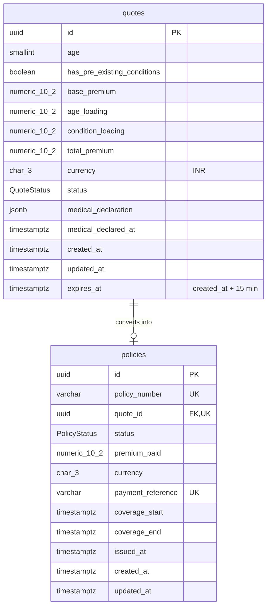

# @careshield/api

NestJS REST API for the CareShield Max D2C purchase journey.
**Phase 1 (this commit): database schema & state management.**

## Quick start

```bash
# from the repo root
docker compose up -d                 # PostgreSQL 16 on :5432
cp apps/api/.env.example apps/api/.env
npm install                          # also runs `prisma generate`
npm run db:migrate -w @careshield/api
npm run start:dev -w @careshield/api # http://localhost:4000/api/v1/health
```

## Data model



### Quote state machine (Task 1.1)

```
QUOTE_GENERATED ──► MEDICAL_DECLARED ──► PREMIUM_PAID ──► POLICY_ISSUED
     (quote)          (disclosures)        (payment)      (policy row exists)
```

Only forward, one-step transitions are legal. They're enforced in two layers:

| Layer | Where | What it does |
| ----- | ----- | ------------ |
| App   | `src/insurance/domain/quote-state-machine.ts` | Transition table, typed errors (`InvalidQuoteTransitionError`, `QuoteExpiredError`). |
| App   | `QuotesRepository.transition()` | Compare-and-set `UPDATE … WHERE id = ? AND status = <from>` — two concurrent requests can't both advance a quote. |
| DB    | trigger `enforce_quote_lifecycle` | Rejects skips/reversals, rejects declaring or paying after `expires_at`, requires a policy row before `POLICY_ISSUED`, and makes pricing fields + `expires_at` immutable. |
| DB    | trigger `enforce_policy_from_paid_quote` | A policy can only be inserted for a `PREMIUM_PAID` quote, for exactly the quoted amount. |

### Money & time (Task 1.2)

- Every money column is `NUMERIC(10,2)` (Prisma `Decimal`, surfaced as `Prisma.Decimal` — never a JS float). Max value ₹99,999,999.99.
- CHECK `total_premium = base_premium + age_loading + condition_loading` keeps the stored breakdown honest.
- All timestamps are `TIMESTAMPTZ(3)`. `expires_at` is computed from the server clock (`computeExpiresAt()` → `now + 15 min`), never from the client.

## Migrations

| Migration | Contents |
| --------- | -------- |
| `20260921000000_init` | Enums, `quotes`, `policies`, indexes, FK (`ON DELETE RESTRICT`). Equivalent to `prisma migrate dev` output for `schema.prisma`. |
| `20260921000100_quote_integrity_rules` | Hand-written: CHECK constraints + lifecycle triggers that Prisma's schema language can't express. |

After changing `schema.prisma`, run `npm run db:migrate:dev -- --name <change>`.

## Tests

```bash
npm test          # unit: state machine + quote lock (no DB)
npm run test:db   # integration: 21 tests against a migrated PostgreSQL
npm run test:e2e  # boots the app, hits /api/v1/health
```

## Stack notes

NestJS 12 (ESM), Prisma 7 (`prisma-client` generator + `@prisma/adapter-pg`, config in `prisma.config.ts`), Vitest, oxlint.
