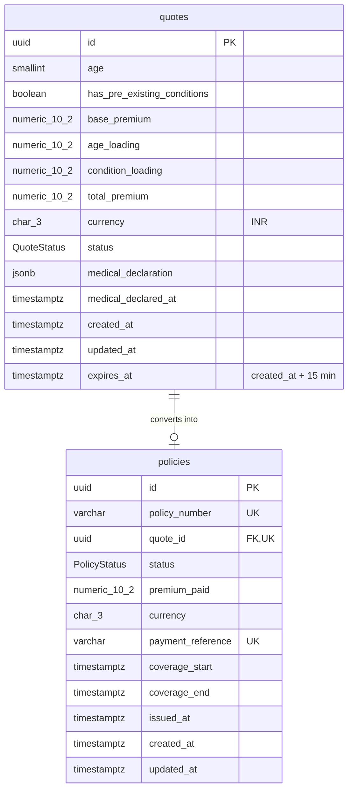

# @careshield/api

NestJS REST API for the CareShield Max D2C purchase journey.
Done so far: **Phase 1** (schema & state), **Phase 2** (quote API & premium engine), plus the medical-declaration endpoint the Phase 3 UI needs.

## Quick start

```bash
# from the repo root
docker compose up -d                 # PostgreSQL 16 on :5432
cp apps/api/.env.example apps/api/.env
npm install                          # also runs `prisma generate`
npm run db:migrate -w @careshield/api
npm run start:dev -w @careshield/api # http://localhost:4000/api/v1/health
```

## Data model



### Quote state machine (Task 1.1)

```
QUOTE_GENERATED ──► MEDICAL_DECLARED ──► PREMIUM_PAID ──► POLICY_ISSUED
     (quote)          (disclosures)        (payment)      (policy row exists)
```

Only forward, one-step transitions are legal. They're enforced in two layers:

| Layer | Where | What it does |
| ----- | ----- | ------------ |
| App   | `src/insurance/domain/quote-state-machine.ts` | Transition table, typed errors (`InvalidQuoteTransitionError`, `QuoteExpiredError`). |
| App   | `QuotesRepository.transition()` | Compare-and-set `UPDATE … WHERE id = ? AND status = <from>` — two concurrent requests can't both advance a quote. |
| DB    | trigger `enforce_quote_lifecycle` | Rejects skips/reversals, rejects declaring or paying after `expires_at`, requires a policy row before `POLICY_ISSUED`, and makes pricing fields + `expires_at` immutable. |
| DB    | trigger `enforce_policy_from_paid_quote` | A policy can only be inserted for a `PREMIUM_PAID` quote, for exactly the quoted amount. |

### Money & time (Task 1.2)

- Every money column is `NUMERIC(10,2)` (Prisma `Decimal`, surfaced as `Prisma.Decimal` — never a JS float). Max value ₹99,999,999.99.
- CHECK `total_premium = base_premium + age_loading + condition_loading` keeps the stored breakdown honest.
- All timestamps are `TIMESTAMPTZ(3)`. `expires_at` is computed from the server clock (`computeExpiresAt()` → `now + 15 min`), never from the client.

## Quote API (Phase 2)

### `POST /api/v1/insurance/quote`

Prices the applicant and saves a quote locked for 15 minutes.

```bash
curl -X POST http://localhost:4000/api/v1/insurance/quote \
  -H 'Content-Type: application/json' \
  -d '{"age": 52, "hasPreExistingConditions": true}'
```

**201 Created**

```json
{
  "quoteId": "f8d293c9-df58-4ff1-9aab-8290dae6c243",
  "status": "QUOTE_GENERATED",
  "applicant": { "age": 52, "hasPreExistingConditions": true },
  "premium": {
    "currency": "INR",
    "base": "10000.00",
    "ageLoading": "5000.00",
    "conditionLoading": "5000.00",
    "total": "20000.00"
  },
  "createdAt": "2026-09-21T18:46:54.489Z",
  "expiresAt": "2026-09-21T19:01:54.489Z",
  "lockDurationSeconds": 900,
  "serverTime": "2026-09-21T18:46:54.545Z",
  "isExpired": false
}
```

Money is returned as 2-decimal **strings** so no JSON client turns it into a float. `serverTime` lets the frontend correct for a wrong device clock when it runs the countdown.

### `GET /api/v1/insurance/quote/:id`

Returns the same shape. Use it to restore a quote after a page refresh; `isExpired` tells you whether the lock has passed.

### `POST /api/v1/insurance/quote/:id/medical-declaration` (journey step 2)

Body: six booleans (`hasDiabetes`, `hasHypertension`, `hasHeartDisease`, `isSmoker`, `hadMajorSurgeryLast5Years`, `hasTerminalIllness`) plus `confirmsAccuracy: true`. On success it moves the quote `QUOTE_GENERATED → MEDICAL_DECLARED` and stores the answers as JSON.

| Response | When |
| -------- | ---- |
| 200 | Eligible; the quote advances |
| 422 `NotEligible` | Terminal illness, or a declared condition the quote wasn't priced for (the UI offers to recalculate) |
| 410 `QuoteExpired` | Past `expires_at` |
| 409 | Already declared |

The eligibility rules in `src/insurance/domain/eligibility.ts` are **placeholders**. Replace them with the product's real rules.

### Pricing (Task 2.2) — `src/insurance/domain/premium-calculator.ts`

| Rule | Amount |
| ---- | ------ |
| Base premium | ₹10,000.00 |
| `age > 45` (46 and over; 45 is not loaded) | + 50% of base = ₹5,000.00 |
| `hasPreExistingConditions: true` | + ₹5,000.00 flat |

| Age | Pre-existing | Total |
| --- | ------------ | ----- |
| 30 | no | ₹10,000.00 |
| 30 | yes | ₹15,000.00 |
| 46 | no | ₹15,000.00 |
| 46 | yes | ₹20,000.00 |

All arithmetic uses `Prisma.Decimal`, never JS numbers.

### Validation (Task 2.1)

Strict by design (`src/common/validation.ts`, `src/insurance/dto/create-quote.dto.ts`):

- `age` must be a whole number from **18 to 99** (the eligibility window is an assumption; change `MIN_ELIGIBLE_AGE` / `MAX_ELIGIBLE_AGE`).
- `hasPreExistingConditions` must be a real JSON boolean.
- No type coercion: `"30"` and `"true"` are rejected, not converted.
- Unknown fields are rejected, so a client can't send its own `totalPremium` or `expiresAt`.

**400 Bad Request** example:

```json
{
  "statusCode": 400,
  "error": "ValidationError",
  "message": "Request validation failed",
  "details": [
    { "field": "age", "errors": ["age must be a whole number"] },
    { "field": "hasPreExistingConditions", "errors": ["hasPreExistingConditions must be true or false"] }
  ]
}
```

### Quote lock (Task 2.3)

`QuotesService.createQuote()` takes **one** server timestamp and sets `created_at = now` and `expires_at = now + 15 min` explicitly, so the lock is exactly 900,000 ms. The client never supplies either value.

### Error mapping — `src/common/domain-exception.filter.ts`

| Domain error | HTTP |
| ------------ | ---- |
| `QuoteExpiredError` | 410 Gone — "recalculate your premium" |
| `InvalidQuoteTransitionError` | 409 Conflict |
| Quote not found | 404 |

## Migrations

| Migration | Contents |
| --------- | -------- |
| `20260921000000_init` | Enums, `quotes`, `policies`, indexes, FK (`ON DELETE RESTRICT`). Equivalent to `prisma migrate dev` output for `schema.prisma`. |
| `20260921000100_quote_integrity_rules` | Hand-written: CHECK constraints + lifecycle triggers that Prisma's schema language can't express. |

After changing `schema.prisma`, run `npm run db:migrate:dev -- --name <change>`.

## Tests

```bash
npm test          # unit (29): state machine, quote lock, pricing, eligibility
npm run test:db   # integration (21): schema rules against a migrated PostgreSQL
npm run test:e2e  # HTTP (38): quote, declaration, validation, health
```

## Stack notes

NestJS 12 (ESM), Prisma 7 (`prisma-client` generator + `@prisma/adapter-pg`, config in `prisma.config.ts`), Vitest, oxlint.
