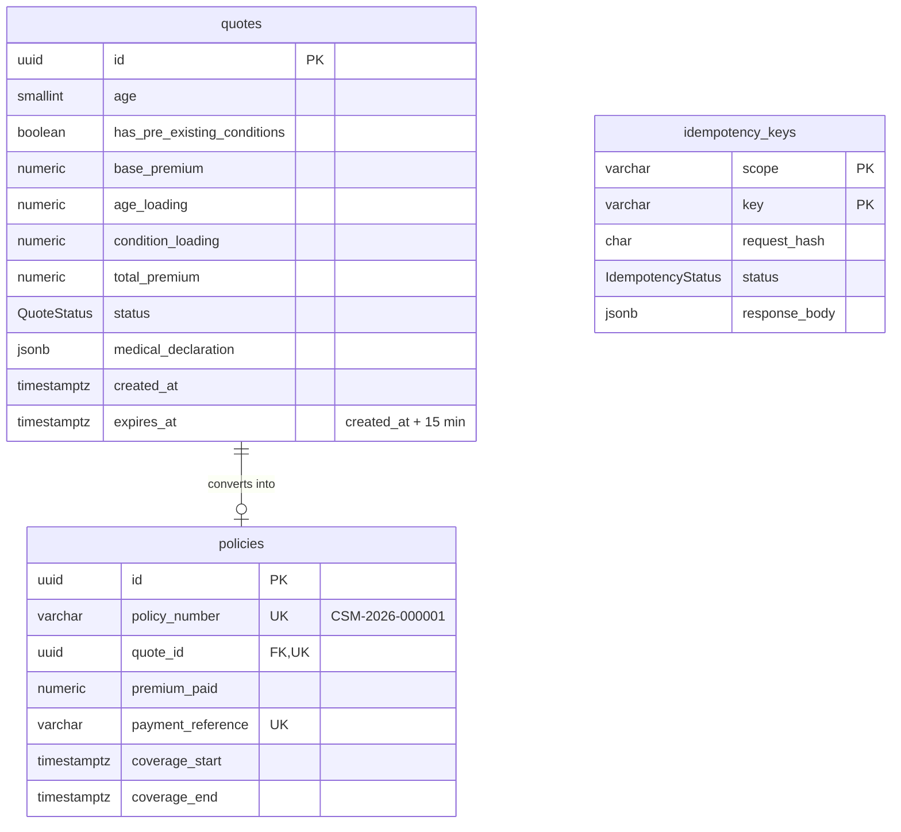

# @careshield/api

NestJS REST API for the CareShield Max purchase journey. All routes are under `/api/v1`.

```bash
npm run start:dev        # http://localhost:4000 (needs apps/api/.env)
npm test                 # unit tests (no database)
npm run test:db          # schema rules against a migrated PostgreSQL
npm run test:e2e         # whole API over HTTP
npm run db:migrate       # apply migrations
```

## Code layout

```
src/
├── main.ts, configure-app.ts   startup: /api/v1 prefix, validation pipe, error filters
├── prisma/                     the shared database client
├── common/                     strict validation + error → HTTP mapping (incl. DB outage → 503)
├── health/                     /health/live and /health/ready
└── insurance/
    ├── domain/                 pure business rules: pricing, state machine, 15-min lock, eligibility
    ├── dto/                    request validation and response shapes
    ├── insurance.controller.ts POST /quote, POST /quote/:id/medical-declaration
    ├── quotes.service.ts       quote logic
    ├── quotes.repository.ts    the only code that changes a quote's status
    └── checkout/               POST /checkout: transaction, idempotency, mock gateway
api/index.js                    Vercel serverless entry (wraps the compiled app in dist/)
prisma/
├── schema.prisma               tables: quotes, policies, idempotency_keys
└── migrations/                 SQL, including the hand-written CHECKs and triggers
```

## Data model



**State machine:** `QUOTE_GENERATED → MEDICAL_DECLARED → PREMIUM_PAID → POLICY_ISSUED`. It only moves forward, one step at a time.

It's enforced twice:

- **In code:** `quotes.repository.ts` does a compare-and-set `UPDATE … WHERE status = <from>`, so two simultaneous requests can't both advance a quote.
- **In the database:** the trigger `enforce_quote_lifecycle` rejects skipped or reversed steps, declaring or paying after `expires_at`, and any change to a quote's price or expiry. The trigger `enforce_policy_from_paid_quote` only allows a policy for a paid quote, at exactly the quoted amount.

## Endpoints

| Endpoint | Success | Errors |
| -------- | ------- | ------ |
| `POST /insurance/quote` `{ age, hasPreExistingConditions }` | 201 quote | 400 validation |
| `POST /insurance/quote/:id/medical-declaration` (6 booleans + `confirmsAccuracy: true`) | 200 quote | 400 · 404 · 409 already declared · 410 expired · 422 not eligible |
| `POST /insurance/checkout` header `Idempotency-Key`, body `{ quoteId, paymentToken }` | 201 policy | 400 · 402 declined · 404 · 409 in progress / already paid / not declared · 410 expired · 422 key reused |
| `GET /health/live` | 200 | never touches the database |
| `GET /health/ready` (alias `/health`) | 200 | 503 `down` or `timeout` (2 s) |

- **Validation is strict:** no type conversion (`"30"` is not a number), unknown fields are rejected, and age must be a whole number from 18 to 99.
- **Money is returned as strings** (`"15000.00"`).
- **Quote responses include `expiresAt` and `serverTime`,** so the website can show an accurate countdown.
- **If the database is unreachable,** every endpoint returns **503** with `Retry-After`.

**Pricing** (`domain/premium-calculator.ts`) uses exact decimals:

| | Amount |
| --- | --- |
| Base premium | ₹10,000 |
| Age over 45 (46 and up) | +50% of base |
| Pre-existing conditions | +₹5,000 flat |

## Checkout: atomic and idempotent

1. **Claim the `Idempotency-Key`** by inserting it with status `IN_PROGRESS`. The primary key means exactly one of several simultaneous requests wins.
   - A repeat of a **finished** request replays the saved response, with no new charge.
   - A repeat of a **running** request gets 409.
   - The **same key with a different body** gets 422.
2. **One transaction:**
   ```
   SELECT … FROM quotes … FOR UPDATE   → second tab waits, then gets "already paid"
   check declared + not expired        → before any charge
   charge the gateway (same key)       → the gateway is idempotent too
   MEDICAL_DECLARED → PREMIUM_PAID → insert policy → POLICY_ISSUED
   mark the key COMPLETED, save the response
   ```
   Any error rolls back all of it. The key is then marked `FAILED`, so a retry with the same key runs again, and the gateway returns the original charge instead of charging twice.
3. **A key orphaned** by a database drop (stuck `IN_PROGRESS` for more than 60 s) can be taken over by a retry.

Mock payment tokens: `tok_visa_4242`, `tok_mastercard_4444` and `tok_upi_success` are approved; `tok_card_declined` is always declined. To use a real provider, replace `MockPaymentGateway` behind the `PAYMENT_GATEWAY` token.

## Notes

- **Migrations:** `20260921000000_init` is what `prisma migrate dev` generates from the schema. The other two are hand-written CHECKs, triggers and the idempotency table.
- **Eligibility rules** in `domain/eligibility.ts` are placeholders.
- **Idempotency keys** are kept for 24 hours. Add a scheduled cleanup before production.
